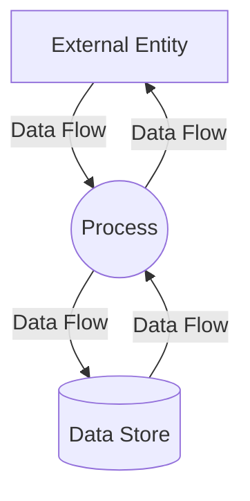

# Data Flow Diagrams for CitiMed System

This directory contains Data Flow Diagrams (DFDs) for the CitiMed medical system at different levels of abstraction:

1. **Context-Level (Level 0) DFD** - Shows the system and its interactions with external entities
2. **Level 1 DFD** - Shows the main processes within the system and their interactions
3. **Level 2 DFD for Visit Management** - Shows a detailed breakdown of the Visit Management process

## Files

- `dfd_analysis.md` - Analysis of the system components for the DFD
- `dfd_level0.md` - Context-Level (Level 0) DFD
- `dfd_level1.md` - Level 1 DFD
- `dfd_level2_visit_management.md` - Level 2 DFD for the Visit Management process

## Converting ASCII Diagrams to Professional Diagrams

The DFDs in this directory are currently in ASCII art format. To create professional-looking diagrams, you can use one of the following tools:

### Option 1: Draw.io (diagrams.net)

1. Go to [diagrams.net](https://app.diagrams.net/)
2. Create a new diagram
3. Use the DFD shape library (available in the More Shapes menu)
4. Recreate the diagrams following the ASCII art structure
5. Export as PNG, SVG, or PDF

### Option 2: Lucidchart

1. Go to [Lucidchart](https://www.lucidchart.com/)
2. Create a new diagram
3. Use the Data Flow Diagram shape library
4. Recreate the diagrams following the ASCII art structure
5. Export as PNG, SVG, or PDF

### Option 3: Mermaid

For a code-based approach, you can use Mermaid, which is supported by many Markdown renderers:

## DFD Symbols

When creating the diagrams, use the standard DFD symbols:

- **Rectangle**: External Entity (source or destination of data)
- **Circle or Rounded Rectangle**: Process (transforms data)
- **Open-ended Rectangle or Line with two parallel lines**: Data Store (stores data)
- **Arrow**: Data Flow (shows movement of data)

## Next Steps

1. Convert the ASCII diagrams to professional diagrams using one of the tools mentioned above
2. Save the diagrams as image files (PNG, SVG) in this directory
3. Update this README with links to the image files
4. Consider adding the diagrams to your documentation
